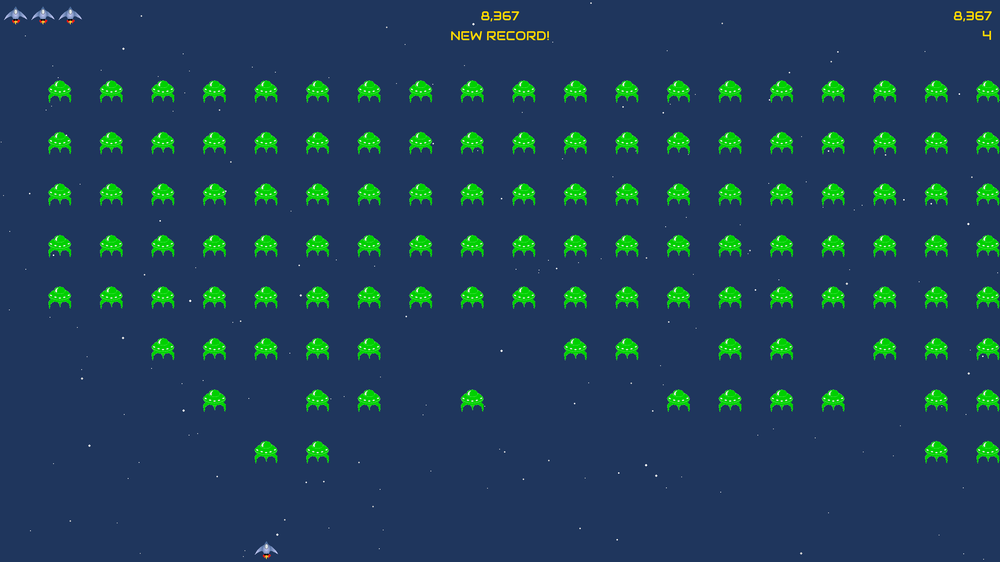
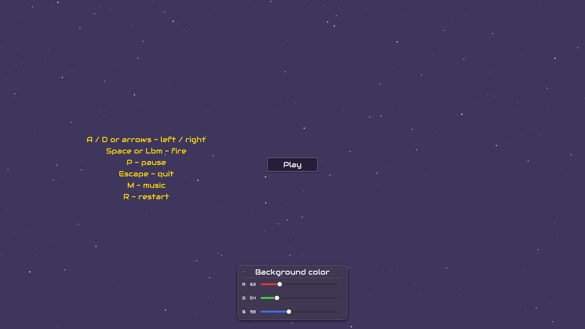

# Alien Invasion


[](https://github.com/Knoowy/Alien_Invasion/releases/latest)

Классическая аркадная игра на Python + Pygame.

Проект основан на игре **Alien Invasion** из книги  
**«Python Crash Course»** Эрика Мэтиза (Eric Matthes).

- 📖 [Книга на No Starch Press](https://nostarch.com/python-crash-course-3rd-edition)
- 🐙 [Официальный репозиторий книги](https://github.com/ehmatthes/pcc_3e)

## 📸 Скриншоты



## 📥 Скачать
**[⬇️ Скачать последнюю версию (Windows, .exe)](https://github.com/Knoowy/Alien_Invasion/releases/latest)**

## 🎮 Управление

| Клавиша | Действие |
|---------|----------|
| A / ← | Движение влево |
| D / → | Движение вправо |
| Space / ЛКМ | Выстрел |
| P | Пауза |
| R | Перезапуск |
| M | Вкл/Выкл музыку |
| Esc | Выход |

## ✨ Особенности

- Ползунки RGB для настройки цвета фона
- Анимированное звёздное небо с эффектом гиперпрыжка
- Сохранение рекорда между запусками
- Игра не привязана к FPS (delta-time)
- Fallback на заглушки при отсутствии ресурсов

## 📦 Установка и запуск

### Требования

- Python 3.10+
- pygame 2.5+

### Запуск из исходников

```bash
git clone https://github.com/Knoowy/Alien_Invasion.git
cd Alien_Invasion
pip install -r requirements.txt
python alien_invasion.py
```

## 🔧 Сборка в EXE

```bash
python -m pip install pyinstaller
python build.py
``` 

## 📄 Лицензия

MIT — см. [LICENSE](LICENSE).